# 🛡️ Awesome GraphQL Security 🚀

  
  
  
  
  

## 📌 Top GraphQL Security Platforms & Tools Ecosystem

**Curated List of Enterprise SaaS Products & Open-Source GitHub Projects for GraphQL API Defense** 

*Comprehensive directory focused on GraphQL API Protection, Query Cost & Depth Limits, Schema Security Auditing, Introspection Leak Prevention, Runtime WAF Defense & API Security Testing.*

---

## 💡 Overview & Market Insights

This repository tracks notable **SaaS platforms** and **open-source projects** for **GraphQL Security**. GraphQL APIs introduce unique attack vectors—such as deep query nesting, batching attacks, field suggestion exploitation, and introspection schema leaks—that legacy Web Application Firewalls (WAFs) fail to detect.

> [!NOTE]
> **Market Size & Structure**: The API Security market is estimated at **$1.2 Billion to $1.8 Billion**, experiencing a rapid CAGR of over **28%**. The broader API security sector is **moderately fragmented**, featuring established web-security vendors alongside agile, GraphQL-native startups.

---

## 📑 Table of Contents
- [🏢 SaaS & Commercial Platforms](#-saas--commercial-platforms)
- [🔓 Open-Source GitHub Projects](#-open-source-github-projects)
- [🛡️ Security Architecture & Best Practices](#%EF%B8%8F-security-architecture--best-practices)
- [🤝 How to Contribute](#-how-to-contribute)
- [☕ Support & Sponsorship](#-support--sponsorship)
- [📈 Star History](#-star-history)
- [⚠️ Disclaimer](#%EF%B8%8F-disclaimer)

---

## 🏢 SaaS & Commercial Platforms

The table below lists leading commercial enterprise platforms for GraphQL security, continuous discovery, behavioral anomaly detection, and posture management. Items are sorted by company scale (revenue/valuation) in descending order.

| Platform | Description | Pricing (Starting Tier) | Free Tier / Trial Limit | Company Scale (Valuation / Revenue) |
| :--- | :--- | :--- | :--- | :--- |
| 🛡️ **[Akamai API Protector](https://www.akamai.com/)** | Enterprise edge & API security protecting GraphQL endpoints against automated bots & OWASP API risks. | ~$2,500/mo (Enterprise App & API Security tier) | 30-day free trial on Akamai Connected Cloud | ~$18.5 Billion Valuation / ~$3.8B Annual Revenue |
| 🏰 **[Imperva API Security](https://www.imperva.com/)** | Enterprise application security suite offering GraphQL inspection and automated API threat prevention. | ~$2,000/mo (Commercial Enterprise Plan) | 30-day free trial with full security evaluation | ~$2.1 Billion Valuation (Acquired by Thales) |
| 🔒 **[Cequence Security](https://www.cequence.ai/)** | Unified API security platform addressing bot attacks, abuse, and vulnerability discovery across GraphQL endpoints. | ~$1,500/mo (Unified API Protection Suite) | 30-day enterprise proof-of-concept / free trial | ~$800 Million Valuation |
| 🧪 **[Salt Security](https://salt.security/)** | AI-driven API security platform providing automated posture management and runtime protection for GraphQL APIs. | ~$1,200/mo (Salt API Protection Platform) | 14-day full platform demo & guided security assessment | ~$1.4 Billion Valuation |
| 🔍 **[Noname Security](https://nonamesecurity.com/)** | Comprehensive API security engine offering GraphQL inventory discovery, runtime defense, and pre-production testing. | ~$1,000/mo (API Posture & Protection Suite) | 30-day free evaluation trial (Acquired by Akamai) | ~$1.0 Billion Valuation (Acquired for $450M) |
| 📊 **[Traceable AI](https://www.traceable.ai/)** | Context-aware API observability & security platform enforcing GraphQL rate limits and threat detection. | ~$800/mo (Enterprise API Security Plan) | Free Tier available (up to 250k calls/mo) + 30-day Enterprise Trial | ~$500 Million Valuation |
| ⚙️ **[42Crunch](https://42crunch.com/)** | Developer-first API security platform auditing GraphQL contracts and enforcing security gates in CI/CD. | $49/developer/mo (Developer Pro Plan) | Free Tier available (Free OpenAPI/GraphQL auditing extension with unlimited standard checks) | ~$150 Million Valuation |
| 🧱 **[Wallarm](https://www.wallarm.com/)** | API security and WAF platform providing GraphQL query parser defense and real-time attack blocking. | ~$500/mo (Cloud Native API Security Plan) | 14-day free trial with full WAF capabilities | ~$100 Million Valuation |
| 🚀 **[Escape](https://escape.tech/)** | GraphQL-native security platform featuring automated DAST, schema auditing, and continuous security testing. | $99/mo (Starter Plan) | Free Tier available (Free schema scanner & 14-day Pro trial) | ~$25 Million Valuation |
| 🌐 **[Inigo](https://inigo.io/)** | GraphQL-specific execution gateway for schema governance, field-level access control, and query depth limiting. | $199/mo (Growth Plan) | Free Tier available (Free for up to 100,000 requests/mo) | ~$15 Million Valuation |

---

## 🔓 Open-Source GitHub Projects

Below are top open-source tools, security libraries, scanners, and middleware for GraphQL API defense. Items are sorted by GitHub star count in descending order.

| Repository | Description | Stars | License |
| :--- | :--- | :--- | :--- |
| ⚡ **[graphql-js](https://github.com/graphql/graphql-js)** | Reference implementation of GraphQL for JavaScript—provides core AST parsing & validation rules for depth/cost limits. |  | MIT |
| 🐍 **[graphene](https://github.com/graphql-python/graphene)** | Python framework for building GraphQL APIs with built-in validation capabilities and field-level permission control. |  | MIT |
| 🚀 **[express-graphql](https://github.com/graphql/express-graphql)** | Express middleware for GraphQL server creation, allowing custom query depth and validation rule injection. |  | MIT |
| 🍫 **[hotchocolate](https://github.com/ChilliCream/hotchocolate)** | Enterprise .NET GraphQL platform with native security rules, query complexity limits, and field-level authorization. |  | MIT |
| 🔷 **[graphql-go](https://github.com/graphql-go/graphql)** | Implementation of GraphQL for Go, supporting context-based query execution controls and complexity analysis. |  | MIT |
| 🛡️ **[graphql-shield](https://github.com/maticzav/graphql-shield)** | Declarative permission and authorization layer for GraphQL schemas to enforce fine-grained access control rules. |  | MIT |
| 🪐 **[mercurius](https://github.com/mercurius-js/mercurius)** | Fastify GraphQL adapter supporting built-in query depth limits, complexity restrictions, and query lru caching. |  | MIT |
| 🕵️ **[inql](https://github.com/doyensec/inql)** | Security testing tool and Burp Suite extension by Doyensec for GraphQL introspection analysis and vulnerability auditing. |  | BSD-3-Clause |
| ⚙️ **[graphql-eslint](https://github.com/dimaMachina/graphql-eslint)** | ESLint plugin for GraphQL schemas & operations to catch security anti-patterns and introspection vulnerabilities in CI. |  | MIT |
| 🧮 **[graphql-query-complexity](https://github.com/slicknode/graphql-query-complexity)** | Complexity analysis library for GraphQL.js to define field costs and block resource exhaustion attacks. |  | MIT |
| 👮 **[graphql-cop](https://github.com/dolevf/graphql-cop)** | Lightweight CLI utility to perform common GraphQL security audits against target endpoints (introspection, batching, aliases). |  | MIT |
| 🛡️ **[graphql-armor](https://github.com/Escape-Technologies/graphql-armor)** | Open-source security middleware for Apollo, Yoga, and Envelop servers—blocks depth, cost, alias, and batching attacks. |  | MIT |
| 🐝 **[graphql-hive console](https://github.com/graphql-hive/console)** | Open-source GraphQL schema registry and analytics platform with security rule governance and breaking change checks. |  | MIT |
| 📚 **[awesome-graphql-security](https://github.com/Escape-Technologies/awesome-graphql-security)** | Curated community collection of resources, write-ups, and tools specifically focused on GraphQL API security. |  | CC0-1.0 |
| 📈 **[graphql-cost-analysis](https://github.com/pa-bru/graphql-cost-analysis)** | Express GraphQL cost analysis middleware to evaluate and limit query cost based on schema directive weights. |  | MIT |
| 🏰 **[graphql-protect](https://github.com/ldebruijn/graphql-protect)** | Language-agnostic open-source security proxy for HTTP GraphQL servers—persisted queries, field suggestions, & limits. |  | MIT |

---

## 🛡️ Security Architecture & Best Practices

To build a robust defense-in-depth architecture for production GraphQL endpoints:

1. **Query Hardening & Rate Limiting**: Deploy [GraphQL Armor](https://github.com/Escape-Technologies/graphql-armor) or [GraphQL Protect](https://github.com/ldebruijn/graphql-protect) to enforce maximum depth, query complexity, and alias limits.
2. **Persisted Queries (Trusted Documents)**: Restrict production GraphQL execution exclusively to pre-approved query hashes.
3. **Disable Introspection**: Turn off introspection schema discovery in production environments to prevent schema mapping by attackers.
4. **CI/CD Security Gates**: Utilize [graphql-eslint](https://github.com/dimaMachina/graphql-eslint) and [42Crunch](https://42crunch.com/) to audit GraphQL schema definitions before deployment.
5. **Runtime API Observability**: Pair open-source server hardening with enterprise API security solutions (e.g., [Escape](https://escape.tech/), [Traceable AI](https://www.traceable.ai/), [Inigo](https://inigo.io/)) for real-time threat detection.

---

## 🤝 How to Contribute

Contributions are highly appreciated! To contribute to this curated list:
1. Fork the repository.
2. Add your tool or library following the existing Markdown tabular format.
3. Submit a Pull Request with a short description of the tool and its security impact.

---

## ☕ Support & Sponsorship

If you find this repository helpful for your API security research or enterprise security stack:
- ⭐ **Star** this repository on GitHub.
- 🔀 **Fork** and share with your API engineering & AppSec teams.
- ☕ **Buy me a coffee / Sponsor**: Support ongoing maintenance via the [GitHub Sponsor Dashboard](https://github.com/sponsors/ishandutta2007).

---

## 📈 Star History

---

## ⚠️ Disclaimer

- This list is community-curated for informational and research purposes only.
- Inclusion does not constitute an official endorsement.
- Modern API security requires comprehensive defense-in-depth strategies beyond individual security tools.

---

  <b>Built for API Security Engineers, GraphQL Developers, and Platform AppSec Teams 🛡️</b> 
  <i>Curated by <a href="https://github.com/ishandutta2007">@ishandutta2007</a> with <a href="https://github.com/ishandutta2007/Awesome-Awesome-Awesome">Awesome-Awesome-Awesome</a></i>

